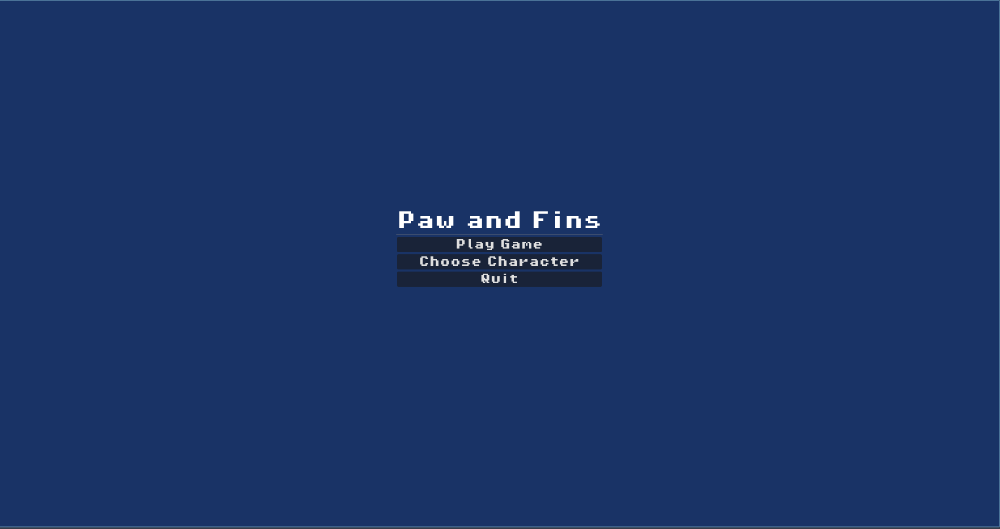
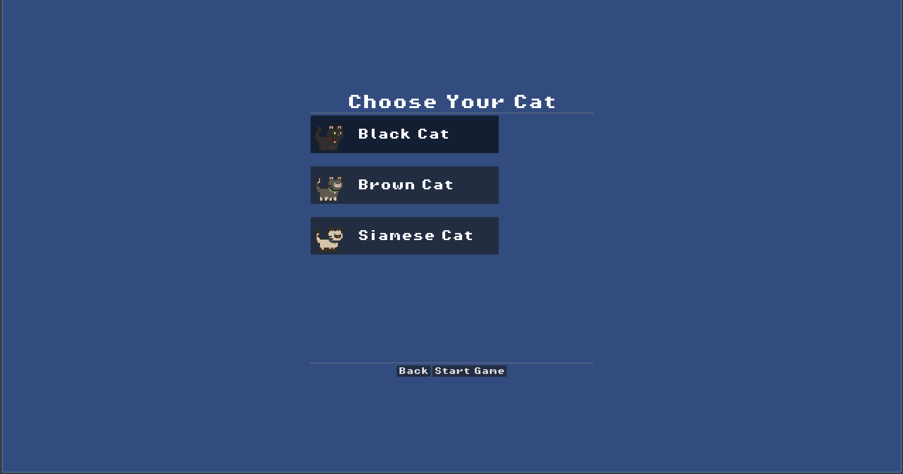
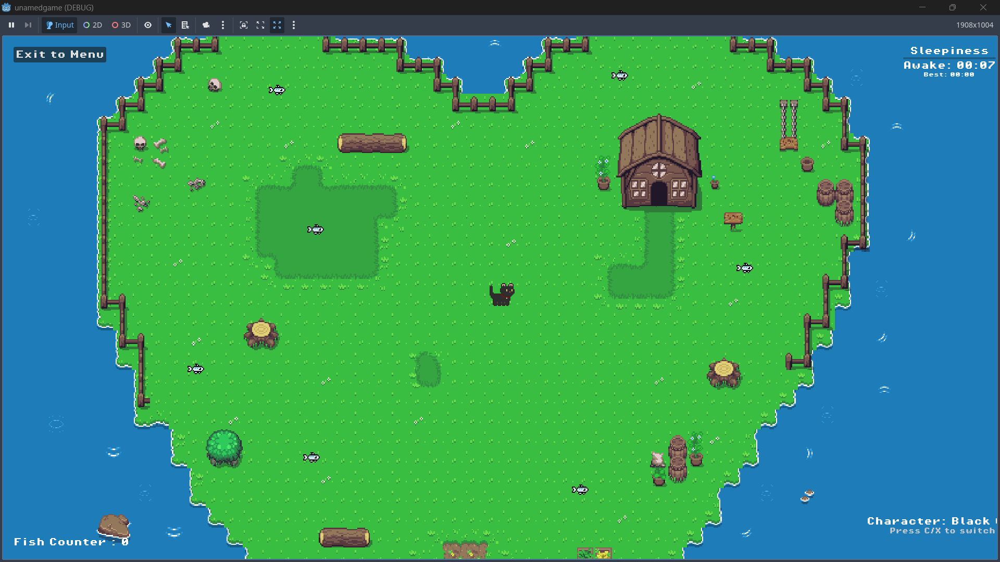
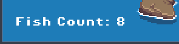
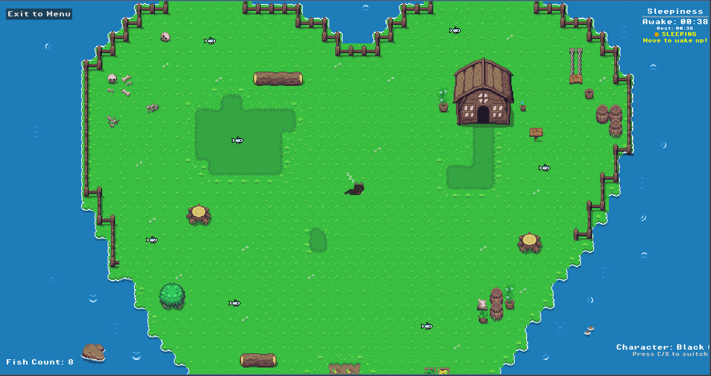

# Paws and Fins 🎯


## Basic Details
### Team Name: Kayakgang


### Team Members
- Team Lead: Krishna Rajeev - Muthoot Institute of Technology and Sciences
- Member 2: Ron Joe - Muthoot Institute of Technology and Sciences

### Project Description
A revolutionary cat simulator where felines collect fish while battling the ultimate enemy: sleepiness! Switch between three adorable cat characters, each with their own sleeping animations, as you try to stay awake as long as possible in this purrfectly pointless aquatic adventure.

### The Problem (that doesn't exist)
Ever wondered what happens when cats get too sleepy while fishing? Neither did we! But apparently, there's a critical shortage of games that track how long cats can stay awake while collecting fish underwater. This pressing issue has plagued humanity for... well, since we invented it 5 minutes ago.

### The Solution (that nobody asked for)
We've created the world's most sophisticated cat-sleepiness tracking system! Watch your chosen feline friend flip horizontally when moving left (because physics), collect fish for absolutely no reason, and eventually succumb to adorable sleep animations. Features include a completely unnecessary high-score system for wake-time achievements and character switching mid-game because why commit to one cat?

## Technical Details
### Technologies/Components Used
For Software:
- **Languages**: GDScript (Godot's native scripting language)
- **Game Engine**: Godot Engine 4.x
- **Graphics**: 2D Sprite Animations, AtlasTexture system for frame extraction
- **Data Storage**: FileAccess API for persistent high-score saving

### Implementation
**Key Features Implemented:**
- **Multi-Character System**: Three unique cat characters with individual sprite sets
- **Sleepiness Mechanics**: Real-time inactivity tracking with visual progress bar
- **High Score Persistence**: Local file storage for tracking longest awake sessions
- **Dynamic Animation Loading**: Runtime sprite frame extraction from texture atlases
- **In-Game Character Switching**: Seamless character swapping during gameplay

#### Installation
```bash
# Clone the repository
git clone https://github.com/solvz/Paws-Fins.git
cd useless_project_temp/pawsandfins

# Install Godot Engine 4.x
# Download from: https://godotengine.org/download
# Or via package manager:
# Ubuntu/Debian: sudo apt install godot
# macOS: brew install godot
# Windows: Download and install from official site
```

#### Run
```bash
# Option 1: Run the exported executable (Recommended for end users)
# Windows:
./PawsAndFins.exe

# Option 2: Open project in Godot Editor (For developers)
```

### Project Documentation
**Game Architecture:**
- **Singleton Pattern**: CharacterManager for global state management
- **Scene Management**: Modular scene system (Main Menu → Character Selection → Game → Sleep State)
- **Animation System**: Dynamic sprite frame loading with AtlasTexture extraction
- **UI Layering**: CanvasLayer system ensuring UI elements stay on top
- **Persistence**: Local file storage for high-score tracking across sessions

# Screenshots

*Main menu with "Paws and Fins" title and navigation options*


*Character selection screen showing three different cat types with preview sprites*


*Active gameplay showing cat character, fish collection, and UI elements including sleepiness bar*


*Detailed view  of the fish count*


*Cat in sleeping state with sleep animation and wake-up instructions*

### Project Demo
# Video
[Complete Game Demo - Google Drive](https://drive.google.com/drive/folders/1ZYgXlVQwiAOfHIpNl91KTeCST2aFY8zf?usp=sharing)

*Complete gameplay demonstration covering character selection, fish collection mechanics, sleepiness tracking, character switching, sleep animations, and the full game loop from start to finish.*

## Team Contributions
- Krishna Rajeev: Game Dev
- Ron Joe: Game Dev

---
Made with ❤️ at TinkerHub Useless Projects 


